List of countries that have done well in their response to COVID-19

<!-- TOC depthFrom:1 depthTo:6 withLinks:1 updateOnSave:1 orderedList:0 -->

- [Hong Kong](#hong-kong)
- [Mongolia](#mongolia)
- [Taiwan](#taiwan)
- [Vietnam](#vietnam)

<!-- /TOC -->

# Hong Kong

COVID-19 cases:

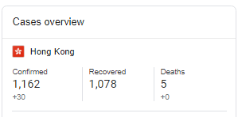

population:

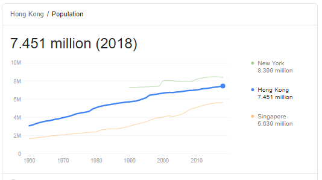

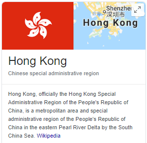

biggest cities:

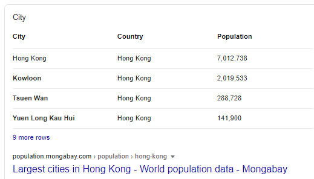

# Mongolia

COVID-19 cases

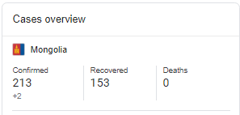

population: 3.15 million.

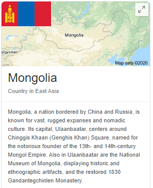

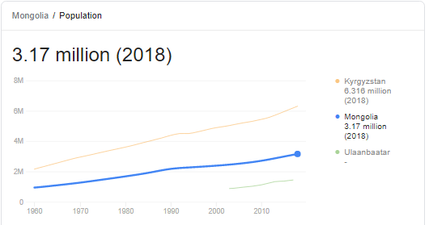

biggest cities

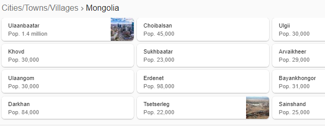

# Taiwan

COVID-19 cases

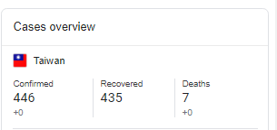

population

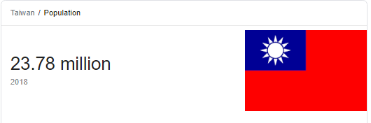

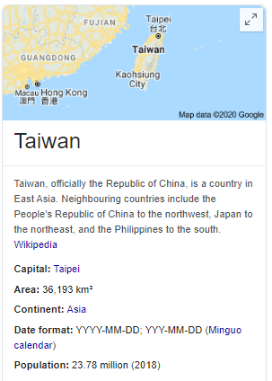

biggest cities:

# Vietnam

COVID-19 cases

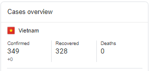

population:

95 million.

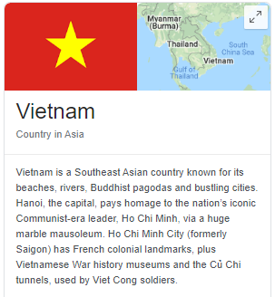

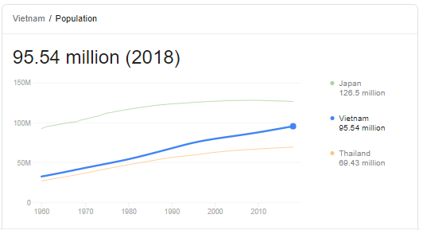

biggest cities:

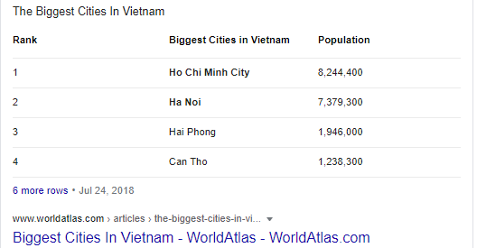

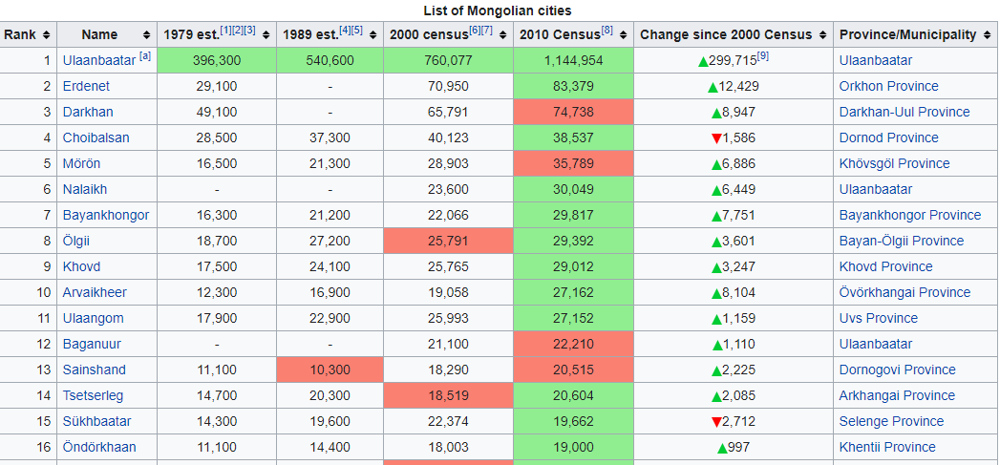
