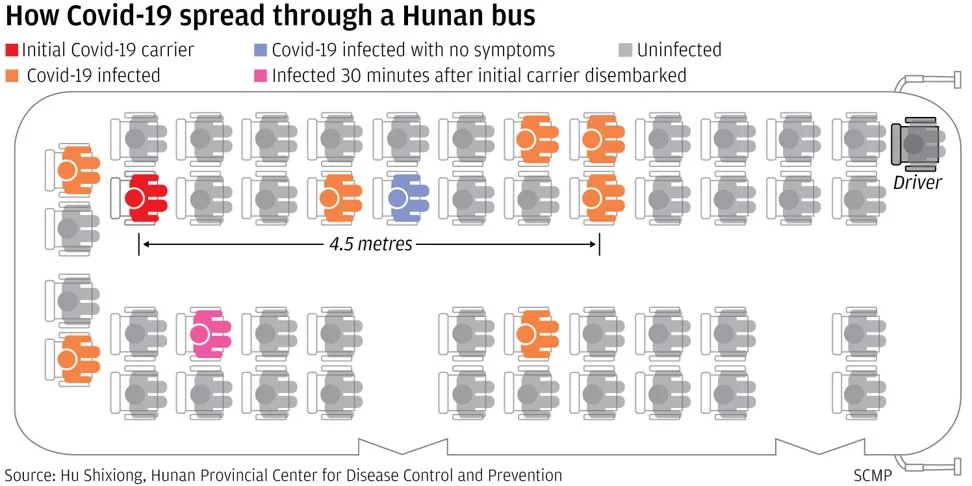
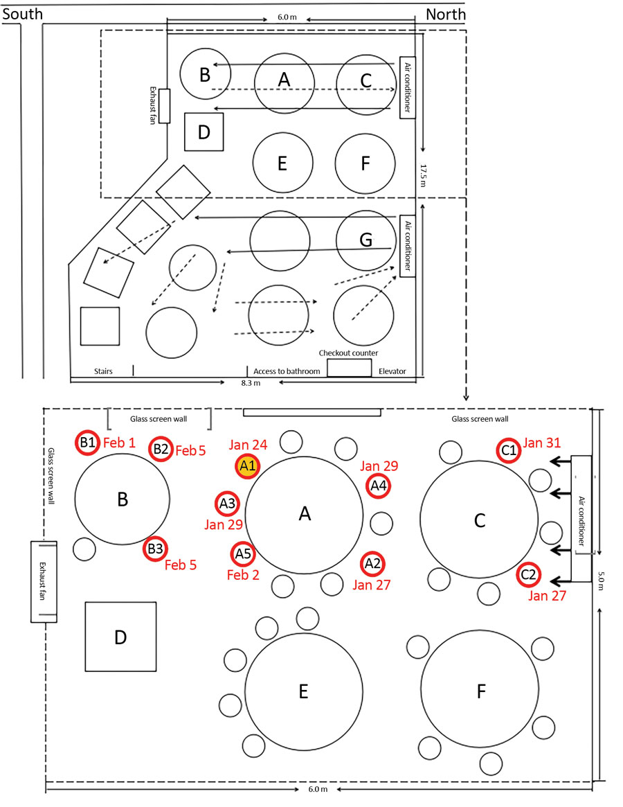
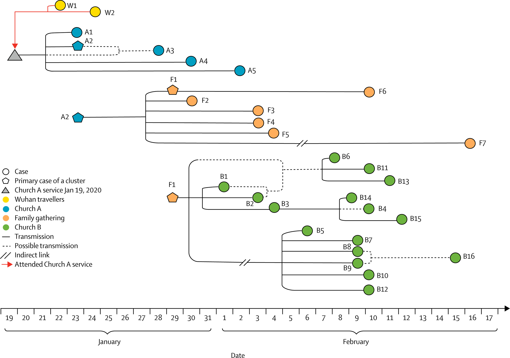
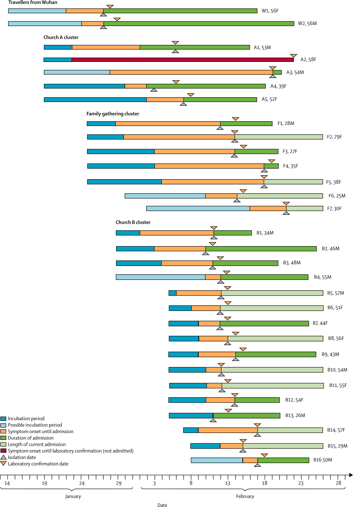
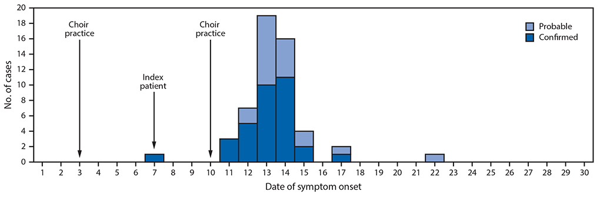
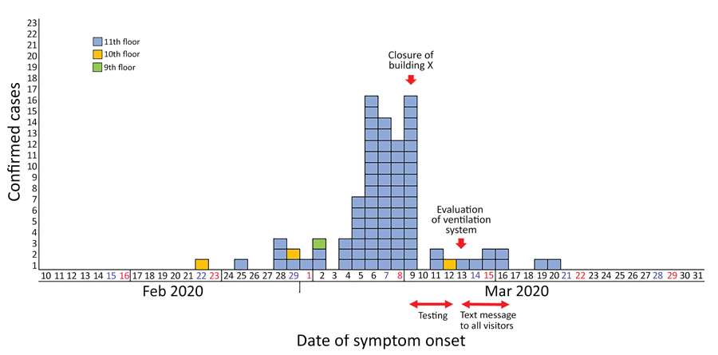
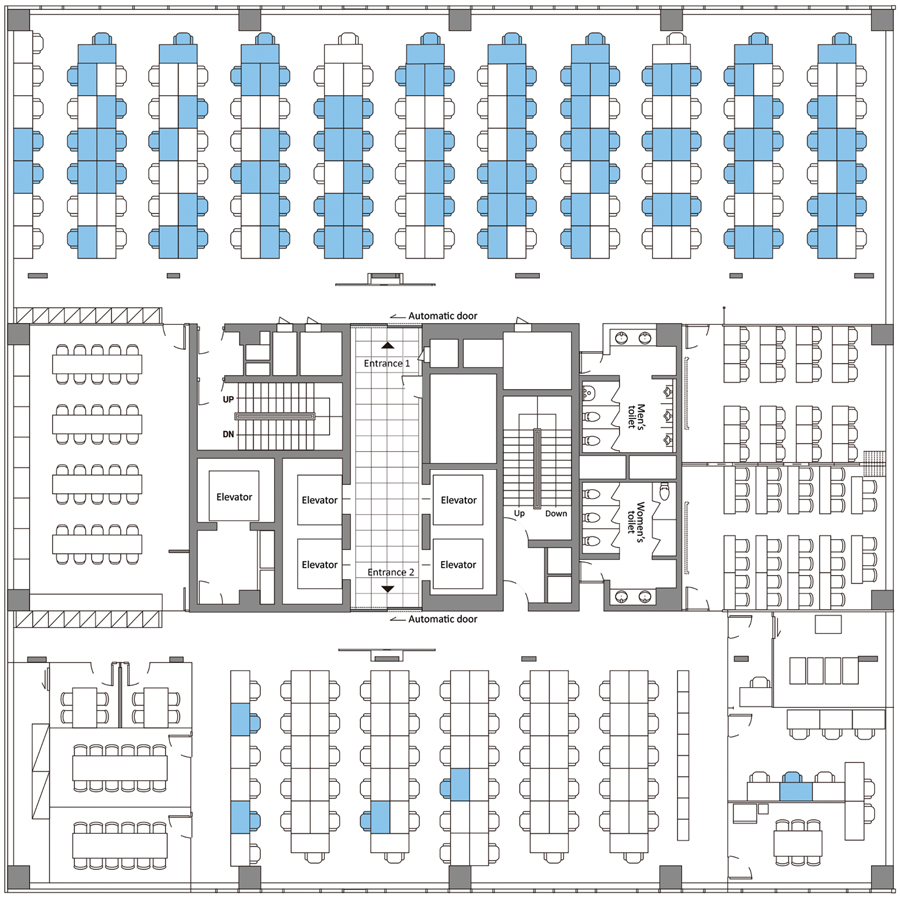

<!-- test -->

# Information about COVID-19 (the disease) and SARS-CoV2 (the virus that causes it)

By [@niemkiewiczIP](https://twitter.com/niemkiewiczIP)  and [@jmcrookston](https://twitter.com/jmcrookston). We are two Toronto intellectual property lawyers with science backgrounds who have many years' experience in various pieces of the health industry.

# Charts of Ontario COVID-19 cases

Data from Ontario government here [https://data.ontario.ca/dataset/confirmed-positive-cases-of-covid-19-in-ontario](https://data.ontario.ca/dataset/confirmed-positive-cases-of-covid-19-in-ontario)

Please remember that the last 7 or so days in every chart are not yet complete, as cases are still being reported.  Do not place any weight on the end tail to these charts.

## If you look at just one chart, look at this one

<iframe width="911" height="707" frameborder="0" scrolling="no" src="https://onedrive.live.com/embed?resid=8AC01DB97FB9EA8B%212545&authkey=%21AErAkjoFAjh5jQw&em=2&wdAllowInteractivity=False&Item=Tor%20Miss%20York%20vs%20rest%20Ont%20comm)&wdInConfigurator=True"></iframe>

## Community transmission by region, and how it spread

<iframe width="911" height="707" frameborder="0" scrolling="no" src="https://onedrive.live.com/embed?resid=8AC01DB97FB9EA8B%212545&authkey=%21AErAkjoFAjh5jQw&em=2&wdAllowInteractivity=False&Item=Ont%20non%20outbreak&wdInConfigurator=True"></iframe>

<iframe width="911" height="707" frameborder="0" scrolling="no" src="https://onedrive.live.com/embed?resid=8AC01DB97FB9EA8B%212545&authkey=%21AErAkjoFAjh5jQw&em=2&wdAllowInteractivity=False&Item=Ont-Tor%20non%20outbreak%20&wdInConfigurator=True"></iframe>

<iframe width="911" height="707" frameborder="0" scrolling="no" src="https://onedrive.live.com/embed?resid=8AC01DB97FB9EA8B%212545&authkey=%21AErAkjoFAjh5jQw&em=2&wdAllowInteractivity=False&Item=Tor%20non%20outbreak&wdInConfigurator=True"></iframe>

<iframe width="911" height="707" frameborder="0" scrolling="no" src="https://onedrive.live.com/embed?resid=8AC01DB97FB9EA8B%212545&authkey=%21AErAkjoFAjh5jQw&em=2&wdAllowInteractivity=False&Item=Peel%20non%20outbreak%20&wdInConfigurator=True"></iframe>

## Toronto vs Ontario numbers

<iframe width="911" height="700" frameborder="0" scrolling="no" src="https://onedrive.live.com/embed?resid=8AC01DB97FB9EA8B%212545&authkey=%21AErAkjoFAjh5jQw&em=2&wdAllowInteractivity=False&Item=Toronto%20v%20Ontario%20total&wdInConfigurator=True"></iframe>

<iframe width="911" height="707" frameborder="0" scrolling="no" src="https://onedrive.live.com/embed?resid=8AC01DB97FB9EA8B%212545&authkey=%21AErAkjoFAjh5jQw&em=2&wdAllowInteractivity=False&Item=Toronto%20v%20Ont%20comm&wdInConfigurator=True"></iframe>

<iframe width="911" height="707" frameborder="0" scrolling="no" src="https://onedrive.live.com/embed?resid=8AC01DB97FB9EA8B%212545&authkey=%21AErAkjoFAjh5jQw&em=2&wdAllowInteractivity=False&Item=Toronto%20v%20Ont%20outbreak&wdInConfigurator=True"></iframe>

## Toronto, Mississauga, York and rest of Ontario

<iframe width="911" height="707" frameborder="0" scrolling="no" src="https://onedrive.live.com/embed?resid=8AC01DB97FB9EA8B%212545&authkey=%21AErAkjoFAjh5jQw&em=2&wdAllowInteractivity=False&Item=Tor%20Miss%20York%20vs%20rest%20Ont%20comm)&wdInConfigurator=True"></iframe>

## Outbreak vs non-outbreak cases

### Ontario

<iframe width="911" height="708" frameborder="0" scrolling="no" src="https://onedrive.live.com/embed?resid=8AC01DB97FB9EA8B%212545&authkey=%21AErAkjoFAjh5jQw&em=2&wdAllowInteractivity=False&Item=Ont%20by%20outbreak%20unstacked&wdInConfigurator=True"></iframe>

<iframe width="911" height="707" frameborder="0" scrolling="no" src="https://onedrive.live.com/embed?resid=8AC01DB97FB9EA8B%212545&authkey=%21AErAkjoFAjh5jQw&em=2&wdAllowInteractivity=False&Item=Ont%20by%20outbreak%20stacked&wdInConfigurator=True"></iframe>

### Toronto

<iframe width="911" height="707" frameborder="0" scrolling="no" src="https://onedrive.live.com/embed?resid=8AC01DB97FB9EA8B%212545&authkey=%21AErAkjoFAjh5jQw&em=2&wdAllowInteractivity=False&Item=Tor%20by%20outbreak%20unstacked&wdInConfigurator=True"></iframe>

<iframe width="911" height="707" frameborder="0" scrolling="no" src="https://onedrive.live.com/embed?resid=8AC01DB97FB9EA8B%212545&authkey=%21AErAkjoFAjh5jQw&em=2&wdAllowInteractivity=False&Item=Tor%20by%20outbreak%20stacked&wdInConfigurator=True"></iframe>

## GTA vs rest of Ontario, only outbreak numbers

<iframe width="911" height="707" frameborder="0" scrolling="no" src="https://onedrive.live.com/embed?resid=8AC01DB97FB9EA8B%212545&authkey=%21AErAkjoFAjh5jQw&em=2&wdAllowInteractivity=False&Item=GTA%20v%20Ont%20outbreak&wdInConfigurator=True"></iframe>

<iframe width="911" height="707" frameborder="0" scrolling="no" src="https://onedrive.live.com/embed?resid=8AC01DB97FB9EA8B%212545&authkey=%21AErAkjoFAjh5jQw&em=2&wdAllowInteractivity=False&Item=GTA%20v%20Ont%20comm&wdInConfigurator=True"></iframe>

# Tips for dealing with COVID-19 (written May 30, 2020)

[I will likely edit this periodically]

Well, Ontario is re-opening.

- we are still confirming ~350-400 cases a day (latest ~320);
(Charts analyzing the outbreak in Ontario, done with a colleague, are now here: https://jonathanmc.github.io/COVID-19-and-SARS-CoV2-info/)

- we have no front line worker testing ready - we will test if you have symptoms (5% of people never develop and incubation period is 4 or 5 days, so those people still can’t get tested);

- no contact tracing yet although just recently announced we have 2000 tracers ready to go (if true, finally!);

- no real plan for people or businesses or condos on how to handle this. No guides to reopening. The retail council made some for their constituents but nothing from the gov.

This will be at BEST be a challenge (read: it’s insane) and we appear to have wasted our lockdown period getting testing/contact tracing up and running. If I seem critical, I am.

That said, this means more personal effort will have to be put into distancing / being safe / doing the tracking ourselves.

Here are some tips. Just my thoughts, based on being repeatedly asked these questions:

- worst place to be as we re-open is closed spaces with recirc air. i.e. office. So try to stay away. stagger work with co-workers. If someone has gone to a big gathering, stay away from others 14 days. You can always isolate yourself voluntarily.

- Outdoors? Reasonably safe. When you’re out, assume everyone is a smoker and that you do not want to smell their smoke. Behave accordingly.

- Masks? They’re great. Use em. They stop you spitting out droplets. In 1918 it stopped measles dead in its tracks in an army hospital, so much so they debating not bothering to quarantine wards that caught measles/scarlet fever. Debating it is simply killing people. BTW, if you are outdoors and reasonably far from people, you can take them off.

- Groceries? Don’t need to wash everything. Just put perishables away leave the rest for 4 days at your front door, then bring it in.

- Gloves? Don’t bother. They just spread virus everywhere. Just wash your hands and when you’re out carry hand sanitizer and use it liberally. You are much safer.

- Going out? If you absolutely need to go out to a risky venue, do it (life can’t stop), be safe, and then isolate once done. That will reduce spread. Keep a journal of who you were around in case you get sick.

- Someone in your household sick? Get them isolated and in a mask. In separate room until a week after they’re better. They should if possible use a separate washroom which is disinfected vigorously, because virus comes through body and out in stool.

- If you live in a condo, see if you can have them block open your garbage room doors so you can use your shoulder to open them. It’s one of the few points in a condo that everybody touches. Automatic doors are good too.

Oh, and this will be seasonal. Wait for it but don’t waste time debating it. At least two CoVs that give us colds, E229 and OC63 are. Also, pig CoV is.

I may add to this or get it on a github. Anyone have other other tips feel free to send my way.

# Examples of clusters of attack of COVID-19.

These may show you how this virus travels. Names are the primary authors of the reported studies. I've only put the graphics here for now.

## Hunan

## Cai

## Lu

## Singapore  

## Choir outbreak

## Korean call centre outbreak

# Useful links

## 1.1.	self-diagnosis sites

<https://covidassessment.org>

<https://www.humandx.org/covid-19/assessment>

## 1.2.	enter your data and it tracks risk, and tells you how much risk in your area

<http://covidnearyou.org/>
- US, Canada and Mexico
- will send updates to phone

<http://flatten.ca/heat-map>
- Canadian

## 1.3.	Modelling / estimates

<https://covid19-projections.com/us>
<https://covid19-projections.com/canada>
<https://covid19-projections.com/canada-ontario>
<https://github.com/youyanggu/covid19_projections/tree/master/r_values>
- machine learning predictions

<https://reichlab.io/covid19-forecast-hub/>
- ensemble models

<https://www.cdc.gov/coronavirus/2019-ncov/covid-data/forecasting-us.html>
- CDC’s page of models

### 1.3.1.	Individual models:

<https://www.covidanalytics.io/projections>
- MIT models - few weeks out only

<https://covid-19.tacc.utexas.edu/projections>
- U Texas models - few weeks out only.

[https://covid-19.bsvgateway.org](https://covid-19.bsvgateway.org)
- Las Alamos models

[http://covid19.healthdata.org/united-states-of-america](http://covid19.healthdata.org/united-states-of-america)
[http://covid19.healthdata.org/canada](http://covid19.healthdata.org/canada)
- IMHE model. Not very reliable. Models peak heathcare use.

[https://epiforecasts.io/covid/posts/national/united-states/](https://epiforecasts.io/covid/posts/national/united-states/)
[https://epiforecasts.io/covid/posts/national/canada/](https://epiforecasts.io/covid/posts/national/canada/)
- R0 estimates

[https://cmmid.github.io/visualisations/inferring-covid19-cases-from-deaths](https://cmmid.github.io/visualisations/inferring-covid19-cases-from-deaths)
- estimating cases where there are one or two deaths.

[http://gabgoh.github.io/COVID/index.html](http://gabgoh.github.io/COVID/index.html)
Epidemic Calculator

[https://art-bd.shinyapps.io/nCov_control/](https://art-bd.shinyapps.io/nCov_control/)
Reporting, epidemic growth, and reproduction numbers for the 2019-nCoV epidemic: understanding control

[https://larremorelab.github.io/covid-calculator1](https://larremorelab.github.io/covid-calculator1)
Prevalence calculator

## 1.4.	Case dashboards and other data

[https://ourworldindata.org/](https://ourworldindata.org/)
- very good

[https://www.ft.com/coronavirus-latest](https://www.ft.com/coronavirus-latest)
- good charts of deaths by countries, including excess mortality charts

[https://www.icuregswe.org/en/data--results/covid-19-in-swedish-intensive-care/](https://www.icuregswe.org/en/data--results/covid-19-in-swedish-intensive-care/)
- Swedish ICU data:

[http://www.cidrap.umn.edu/covid-19/maps-visuals](http://www.cidrap.umn.edu/covid-19/maps-visuals)
- List of COVID-19 tracking dashboards

[https://coronavirus.jhu.edu/map.html](https://coronavirus.jhu.edu/map.html)
[https://gisanddata.maps.arcgis.com/apps/opsdashboard/index.html#/bda7594740fd40299423467b48e9ecf6](https://gisanddata.maps.arcgis.com/apps/opsdashboard/index.html#/bda7594740fd40299423467b48e9ecf6)
- Johns Hopkins

- GITHUB repo of all WHO sitreps
https://github.com/CSSEGISandData/COVID-19

http://nssac.bii.virginia.edu/covid-19/dashboard/
- Can animate the outbreak

https://qap.ecdc.europa.eu/public/extensions/COVID-19/COVID-19.html

https://ncov.dxy.cn/ncovh5/view/pneumonia
- Chinese numbers

https://www.healthmap.org/covid-19/

https://www.google.com/search?&q=covid+number
- Google search will show you covid numbers.
- Google news dashboard:

https://news.google.com/covid19/map?hl=en-CA&gl=CA&ceid=CA:en

https://covid19.who.int/
- WHO dashboard. Largely useless.

### 1.4.1.	Canada

official:

<https://www.canada.ca/en/public-health/services/diseases/2019-novel-coronavirus-infection.html>
Canada cases, official

<https://experience.arcgis.com/experience/2f1a13ca0b29422f9b34660f0b705043/>
Public Health Canada’s dashboard, by province
- not great

unofficial:

<http://www.covid-19canada.com/>
Canada cases, unofficial:

<https://art-bd.shinyapps.io/covid19canada/>
- not great

### 1.4.2.	Ontario

official

<http://covid-19.ontario.ca/>
- main page
- links to the responding page below
- also links to data
  1. data on cases
<https://data.ontario.ca/dataset/confirmed-positive-cases-of-covid-19-in-ontario>
  1. data on status of cases
<https://data.ontario.ca/dataset/status-of-covid-19-cases-in-ontario>
  1. dataset:
<https://data.ontario.ca/dataset/confirmed-positive-cases-of-covid-19-in-ontario/resource/455fd63b-603d-4608-8216-7d8647f43350>
- Ontario data

<https://www.ontario.ca/page/how-ontario-is-responding-covid-19>
- has stats
- links to epi data:
<https://covid-19.ontario.ca/covid-19-daily-epidemiologic-summaries-public-health-ontario>
-- daily epi summaries

<https://www.ontario.ca/page/2019-novel-coronavirus>
- Ontario COVID-19 page

<https://covid-19.ontario.ca/how-your-organization-can-help-fight-coronavirus>
- how you can help

unofficial:

<https://howsmyflattening.ca/#/analysis>
Ontario specific.
- has testing numbers

<https://public.tableau.com/profile/oma.era#!/vizhome/CovidTable/Dashboard22>
- Ontario Medical Association
- pretty good dashboard

<http://www.ontario19.com/>
- has cases per 100k per region

rules etc:

Health Protection and Promotion Act, RSO 1990, c H.7

Emergency Management and Civil Protection Act, RSO 1990, c E
<https://www.canlii.org/en/on/laws/stat/rso-1990-c-e9/latest/rso-1990-c-e9.html>

### 1.4.3.	Regional, City of Toronto, etc.

<https://www.toronto.ca/home/covid-19/>

<https://www.toronto.ca/home/covid-19/covid-19-latest-city-of-toronto-news/covid-19-status-of-cases-in-toronto/>

<https://www.toronto.ca/home/covid-19/covid-19-what-you-should-do/covid-19-orders-directives-by-laws/>

Haldimand orders:
<https://hnhu.org/orders-issued-by-the-medical-officer-of-health/>

### 1.4.4.	US

<https://covidtracking.com/>
tracks US cases by state and grades the data

<https://coronavirus.1point3acres.com/en>
US and Canada information

### 1.4.5.	US by state

<https://www.nytimes.com/interactive/2020/04/03/upshot/coronavirus-metro-area-tracker.html?action=click&module=RelatedLinks&pgtype=Article>

<https://www.sfdph.org/dph/alerts/coronavirus.asp>
San Francisco

<https://data.sfgov.org/stories/s/fjki-2fab>
San Francisco

# Scientific  resources

1974 Monto - review of corona
  https://www.ncbi.nlm.nih.gov/pmc/articles/PMC2595130/pdf/yjbm00155-0028.pdf

1975 Coronaviridae. Tyrrell DA, Almeida JD, Cunningham CH, Dowdle WR, Hofstad MS, McIntosh K, Tajima M, Zakstelskaya LY, Easterday BC, Kapikian A, Bingham RW.
<https://www.ncbi.nlm.nih.gov/pubmed/1184350>

Intervirology. 1978;10(6):321-8. Coronaviridae: second report. Tyrrell DA, Alexander DJ, Almeida JD, Cunningham CH, Easterday BC, Garwes DJ, Hierholzer JC, Kapikian A, Macnaughton MR, McIntosh K.
<https://www.ncbi.nlm.nih.gov/pubmed/213397>

1979 Characterization of coronaviruses 1-s2.0-0042682279904689-main

1979 Robb and Bond - Pathogenic murine coronaviruses 1-s2.0-0042682279904677-main
<https://www.sciencedirect.com/science/article/pii/0042682279904677>

1980 Siddell - Biochemistry of coronaviruses
<https://www.ncbi.nlm.nih.gov/pubmed/7039259>

1981 Biochemistry and Biology of Coronaviruses V. ter MeulenS. SiddellH. Wege
<https://link.springer.com/content/pdf/10.1007%2F978-1-4757-0456-3.pdf>

1981 Mahy 1981 - Biochemistry Of Coronaviruses
<https://www.ncbi.nlm.nih.gov/pubmed/6300299>
<https://www.microbiologyresearch.org/content/journal/jgv/10.1099/0022-1317-64-4-761>

1983 Siddell - Biology of coronaviruses (J Gen Virol) - JV0640040761

1983 Siddell - Coronaviridae (Intervirology)
<https://www.ncbi.nlm.nih.gov/pubmed/6654644>

2010 Infectious Diseases book - Schaffer et al “Respiratory chapter”
<https://www.sciencedirect.com/science/article/pii/B9780323045797001623>

2012 Virus taxonomy book
<https://www.sciencedirect.com/science/article/pii/B9780123846846000689>

2012 Virology book - Korsman “Human coronaviruses”
<https://www.sciencedirect.com/science/article/pii/B9780443073670000409>

2015 Anthony R. Fehr and Stanley Perlman, M.D., Ph.D - Coronaviruses: An Overview of Their Replication and Pathogenesis
<https://www.ncbi.nlm.nih.gov/pmc/articles/PMC4369385/>

# Other resources

## Ontario provincial briefings

- CPAC posts all provincial briefings here: <https://www.youtube.com/user/cpac>
- May 29 briefing, for example, <https://youtu.be/0Es3FVv7Dgk>

## Documents

[SARS Commission report](https://jonathanmc.github.io/COVID-19-and-SARS-CoV2-info/documents/2004-2006 SARS Commission reports (interim and final)/00 full report 268478.pdf)

[SARS Commission report website](http://www.archives.gov.on.ca/en/e_records/sars/report/index.html)

# Masks
